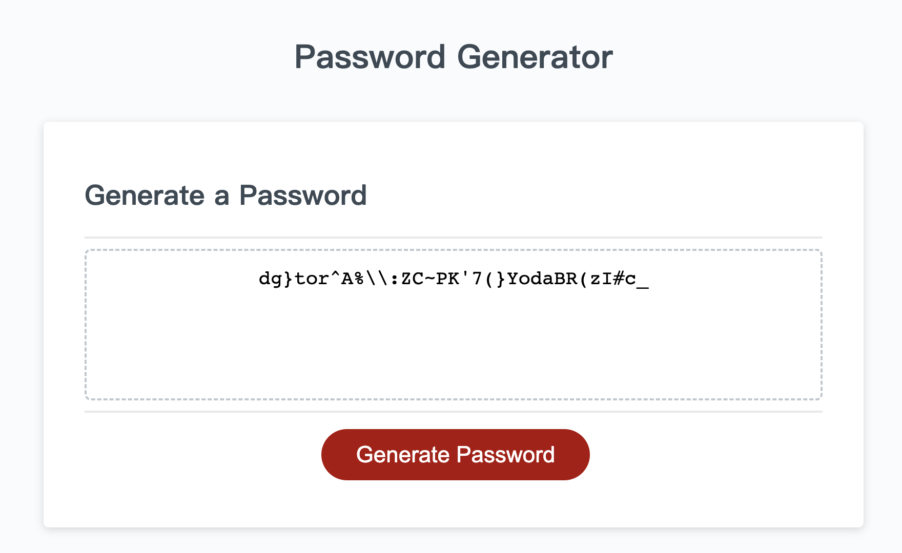

# Password_Generator
This activity is create an application that an employee can use to generate a random password.

Feel free to visit the Website below :
https://ian29012.github.io/Password_Generator/

Your task is to write JavaScript code that analyzes the records to calculate each of the following:
* Generate a password when the button is clicked
  * Present a series of prompts for password criteria
    * Length of password
      * At least 10 characters but no more than 64.
    * Character types
      * Lowercase
      * Uppercase
      * Numeric
      * Special characters ($@%&*, etc)
  * Code should validate for each input and at least one character type should be selected
  * Once prompts are answered then the password should be generated and displayed in an alert or written to the page